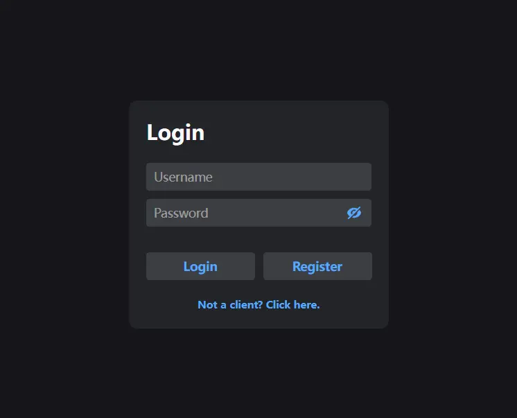
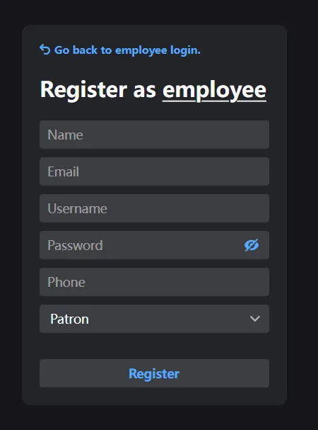
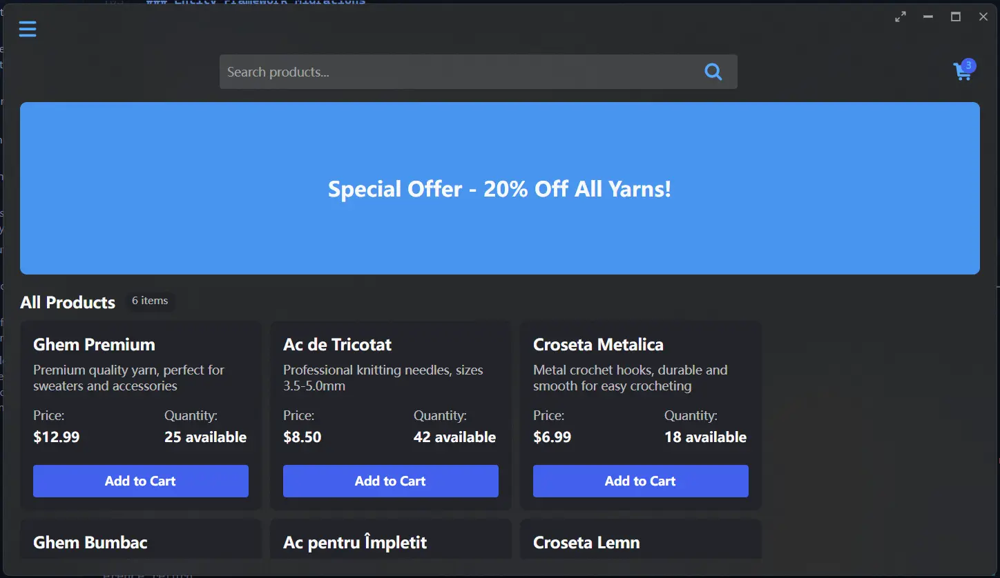
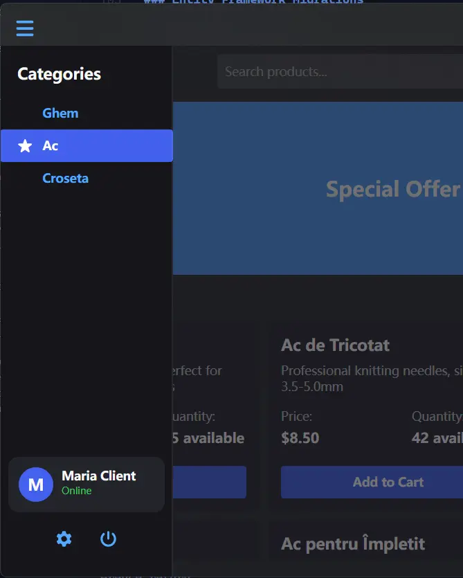

# 🧵 Magazin Mercerie

A desktop application for managing a mercerie (sewing/haberdashery) shop built with .NET, Avalonia UI, and Entity Framework Core.

## 📋 Project Overview

This application helps manage a mercerie shop's operations, including:

- Product inventory management
- Customer information tracking
- Order processing
- Employee management
- Role-based access control

## 📸 Screenshots

### 🔑 Login Client Window



**Description**: The client login interface featuring a clean, modern design with username and password fields. The interface includes validation feedback and a visually appealing layout following Avalonia UI design principles.

### 👤 Register Employee Window



**Description**: Employee registration form with fields for personal information and account credentials. The form includes validation and follows the same design language as the rest of the application for a consistent user experience.

### 🏠 Client Main Window



**Description**: The main client dashboard displaying product catalog, order history, and shopping cart. The interface allows clients to browse products, place orders, and manage their account information in a user-friendly environment.

### 📚 Sidebar



**Description**: Navigation sidebar providing quick access to all main application features. The collapsible design maximizes screen space while maintaining accessibility to core functionality through intuitive icons and labels.

## 🛠️ Technology Stack

- **Framework**: .NET 9.0
- **UI**: Avalonia UI 11.2 (cross-platform UI framework)
- **UI Design Pattern**: MVVM (Model-View-ViewModel)
- **Database ORM**: Entity Framework Core 9.0
- **Database**: SQLite
- **Logging**: log4net

## 📁 Project Structure

- **Models/**: Entity classes representing business domain objects

  - `Entity.cs`: Base entity class with ID
  - `User.cs`: Base user class
  - `Client.cs`, `Angajat.cs`, `Patron.cs`: User types
  - `Produs.cs`: Product entity
  - `Comanda.cs`: Order entity
  - `Enum/`: Enumeration types

- **Data/**: Database context and configuration

  - `AppDbContext.cs`: EF Core database context

- **Repository/**: Data access layer

  - `Interfaces/`: Repository interfaces
  - `Implementations/`: Repository implementations

- **ViewModels/**: MVVM view models

  - Handling UI logic and interactions

- **Views/**: UI definitions
  - `ClientViews/`: UI for client functionality
  - `AngajatViews/`: UI for employee functionality

## 🚀 Getting Started

### Prerequisites

- .NET SDK 9.0 or later
- Visual Studio 2022, VS Code, or JetBrains Rider

### Running the Application

1. Clone the repository:

   ```
   git clone https://github.com/yourusername/magazin-mercerie.git
   cd magazin-mercerie
   ```

2. Restore dependencies:

   ```
   dotnet restore
   ```

3. Apply database migrations:

   ```
   dotnet ef database update
   ```

4. Run the application:
   ```
   dotnet run
   ```

## 🔄 Entity Relationships

- **User** (base class)

  - **Client**: Can place orders
  - **Angajat**: Can manage orders and products
  - **Patron**: Has additional administrative privileges

- **Comanda** (Order)

  - Each order belongs to one Client
  - Each order is processed by one Angajat
  - Each order contains multiple Produse (Products)

- **Produs** (Product)
  - Categorized by TipProdus (Product Type)
  - Can appear in multiple Comenzi (Orders)

## 💻 Development Notes

### Entity Framework Migrations

To create a new migration after model changes:

```
dotnet ef migrations add MigrationName
dotnet ef database update
```

### Repository Pattern

The application uses the repository pattern to abstract data access:

- Generic `Repository<T>` base class
- Specific repositories (UserRepository, ProdusRepository, etc.)
- Interfaces defining repository contracts

### Authentication

The application provides separate login flows for:

- Clients (regular customers)
- Angajati (employees with different privileges)
